# Newphone — Spring Boot

Versión con **Spring Boot**, **Thymeleaf** y **SQLite** del centro de operaciones
Newphone (celulares y accesorios). Conserva los 16 módulos de la versión en
servlets y los presenta con una interfaz oscura inspirada en el logo oficial.

## Tecnologías

- Java 21
- Spring Boot 4 (Web MVC, Thymeleaf, Validation, JDBC)
- SQLite (sin MySQL ni PostgreSQL)
- Maven
- JUnit 5 y Mockito (pruebas unitarias por módulo)

## Requisitos

| Recurso | Versión |
| --- | --- |
| JDK | 21 (debe ser JDK, no JRE) |
| Maven | Incluido como wrapper (`mvnw.cmd` / `mvnw`) |
| Base de datos | Ninguna instalación: SQLite se crea sola |

## Inicio rápido

```powershell
.\mvnw.cmd spring-boot:run
```

Luego abre `http://localhost:8080`. La base de datos y los datos de
demostración se crean en el primer arranque.

## Arquitectura

El código se organiza por **módulos reutilizables** y, dentro de cada uno, por **capas**:

```text
com.newpohone
├── config                  → configuración (DataSource, interceptores)
├── shared                  → componentes transversales reutilizables
│   ├── domain              → MoneyFormatter, TextNormalizer
│   ├── presentation        → SessionUsers, RequestParsers
│   └── infrastructure      → DatabaseBootstrap
└── modules
    ├── autenticacion
    ├── catalogo
    ├── carrito
    ├── checkout
    ├── pedidos
    ├── inventario
    ├── favoritos
    ├── dashboard
    └── crud
        ├── presentation    → controladores y ControllerAdvice
        ├── application     → servicios de negocio
        ├── domain          → modelos, validadores y excepciones
        └── infrastructure  → repositorios JDBC
```

Los recursos web se distribuyen así:

```text
src/main/resources
├── application.properties
├── db/                     → schema.sql y seed.sql
├── static/                 → css, js e imágenes
└── templates/              → auth, catalog, dashboard, inventory,
                              modules, orders, layout, fragments
```

## Módulos y rutas

| Módulo | Ruta principal | Acceso |
| --- | --- | --- |
| Catálogo | `/` y `/catalog` | Público |
| Carrito | `/cart` y API `/catalog/cart` | Público |
| Checkout | `/checkout` | Público |
| Seguimiento | `/seguimiento` | Público |
| Autenticación | `/login` y `/register` | Público |
| Favoritos | `/favoritos` | Cliente |
| Dashboard | `/dashboard` | Administrador |
| Pedidos | `/pedidos` | Administrador |
| Inventario | `/inventario` | Administrador |
| CRUD de los 16 módulos | `/modules/{clave}` | Administrador |

Las rutas de administrador están protegidas por `AuthInterceptor`: un cliente que
intente entrar es redirigido al catálogo.

## Funcionalidades

- Login y registro de clientes con sesiones HTTP
- Contraseñas protegidas con PBKDF2 (upgrade automático desde texto plano del seed)
- Catálogo público con buscador, filtros y ordenación
- Carrito en sesión con control de stock
- Checkout con validación de pago, guía de seguimiento y descuento de inventario
- Gestión de pedidos con estados, línea de tiempo y devolución de stock al cancelar
- Dashboard con ventas, pedidos, clientes, inventario y tickets
- CRUD completo de los 16 módulos
- Base de datos y datos de demostración creados automáticamente

## Configuración

Propiedades propias en `src/main/resources/application.properties`:

| Propiedad | Valor por defecto | Para qué sirve |
| --- | --- | --- |
| `server.port` | `8080` | Puerto HTTP |
| `newphone.inventory.low-stock-threshold` | `30` | Umbral de alerta de stock bajo |
| `newphone.whatsapp.phone` | `573001001001` | Número del botón de WhatsApp |
| `newphone.contact.email` | `asesor@newphone.com` | Correo de contacto |
| `newphone.contact.hours` | Lunes a sábado… | Horario mostrado en la tienda |

## Base de datos

SQLite se inicializa automáticamente en:

```text
%USERPROFILE%\.newphone\newphone-spring.db
```

Para usar otra ruta:

```text
-Dnewphone.database=C:\ruta\personalizada\newphone.db
```

El esquema (16 tablas) y los datos de demostración los aplica `DatabaseBootstrap`
en cada arranque, sin perder la información existente. Para empezar de cero,
basta con borrar el archivo `.db`.

### Modelo relacional

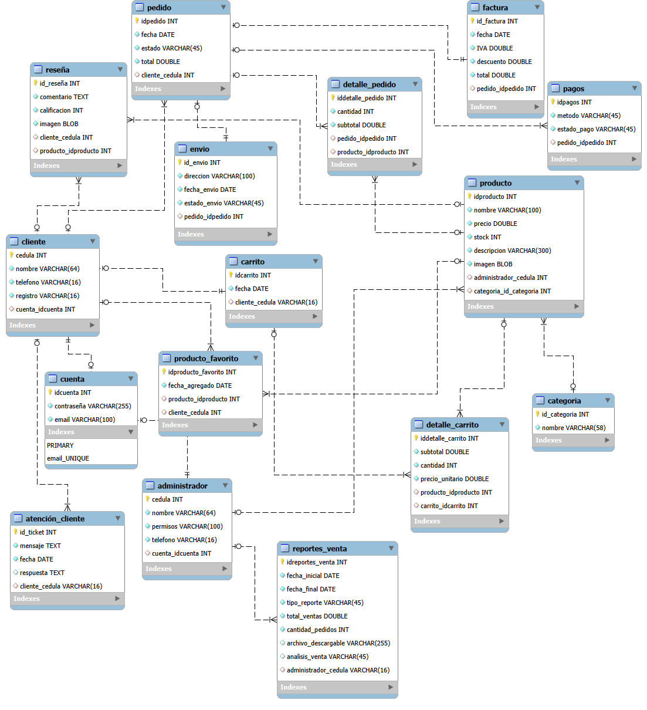

### Tablas

| Grupo | Tablas |
| --- | --- |
| Usuarios | `cuenta`, `cliente`, `administrador` |
| Catálogo | `categoria`, `producto`, `resena` |
| Compras | `carrito`, `detalle_carrito`, `producto_favorito` |
| Pedidos | `pedido`, `detalle_pedido`, `envio`, `factura`, `pagos` |
| Atención | `atencion_cliente` |
| Reportes | `reportes_venta` |

`cuenta` guarda las credenciales y se enlaza con `cliente` o `administrador`,
que es lo que define el rol del usuario al iniciar sesión.

### Reglas de integridad

- Claves foráneas activas (`PRAGMA foreign_keys = ON`).
- Correo de la cuenta y teléfono de cliente y administrador irrepetibles.
- Guía de envío única, usada para el seguimiento del pedido.
- Una sola reseña y un solo favorito por cliente y producto.
- `CHECK` sobre precios, stock, cantidades y totales para impedir valores negativos,
  y calificación de reseñas entre 1 y 5.

El script está en `src/main/resources/db/schema.sql` y los datos de demostración
en `db/seed.sql`.

## Acceso demo

```text
Correo: admin@newphone.com
Contraseña: admin123
```

## Catálogo público

Sin iniciar sesión puedes ver el listado de productos en:

```text
http://localhost:8080/
http://localhost:8080/catalog
```

Incluye buscador, filtros por categoría/precio/disponibilidad y ordenación.
Responsive para escritorio y móvil.

## Pruebas

```powershell
# Todas las pruebas
.\mvnw.cmd test

# Un módulo puntual
.\mvnw.cmd "-Dtest=CartServiceTest,CartTest" test
```

Hay **45 pruebas** en 21 clases: unitarias con JUnit 5 y Mockito para cada
módulo, más una de integración que verifica el arranque del contexto de Spring.
Los informes quedan en `target/surefire-reports/`.

## Ejecución en IntelliJ IDEA

1. Abre la carpeta del proyecto como proyecto Maven.
2. Espera a que IntelliJ importe dependencias (`pom.xml`).
3. Confirma **JDK 21** en *File → Project Structure → Project*.
4. Ejecuta la clase `com.newpohone.ProyectoGa722501096Application`
   (clic derecho → **Run**), o usa el panel Maven:

```text
Plugins → spring-boot → spring-boot:run
```

También desde la terminal integrada de IntelliJ:

```powershell
.\mvnw.cmd spring-boot:run
```

La aplicación queda en:

```text
http://localhost:8080
```

## Empaquetado

```powershell
.\mvnw.cmd clean package
java -jar target\proyecto-ga-722501096-1.0.0.jar
```

`clean package` ejecuta las pruebas antes de generar el JAR.

## Solución de problemas

| Síntoma | Causa y solución |
| --- | --- |
| `No compiler is provided in this environment` | `JAVA_HOME` apunta a un JRE. Hazlo apuntar a un JDK 21. |
| El puerto 8080 está ocupado | Arranca con `--server.port=8081`. |
| Quieres reiniciar los datos | Borra `%USERPROFILE%\.newphone\newphone-spring.db` y vuelve a arrancar. |

## Documentación

| Documento | Contenido |
| --- | --- |
| [Módulos integrados](docs/GA8-220501096-AA1-EV02-modulos-integrados.md) | Documentación por módulo y componente con datos de entrada y salida, informe de pruebas y configuración de servidores y base de datos |
| [Ambientes de desarrollo y pruebas](docs/ambientes-desarrollo-pruebas.md) | Requisitos, configuración de cada ambiente y cómo ejecutar pruebas |

## Capturas de pantalla

<details>
<summary>Ver las 16 capturas</summary>

### Catálogo público

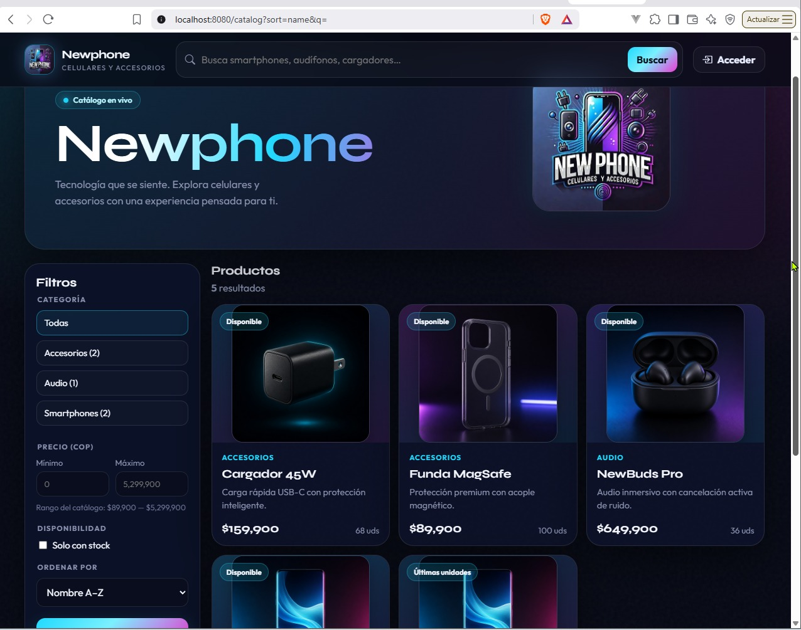

### Login


### Dashboard — Centro de operaciones

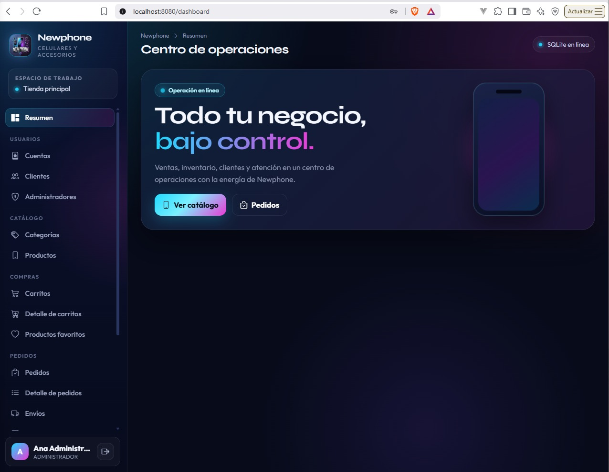

### Dashboard — Resumen con métricas


### Módulo Cuentas

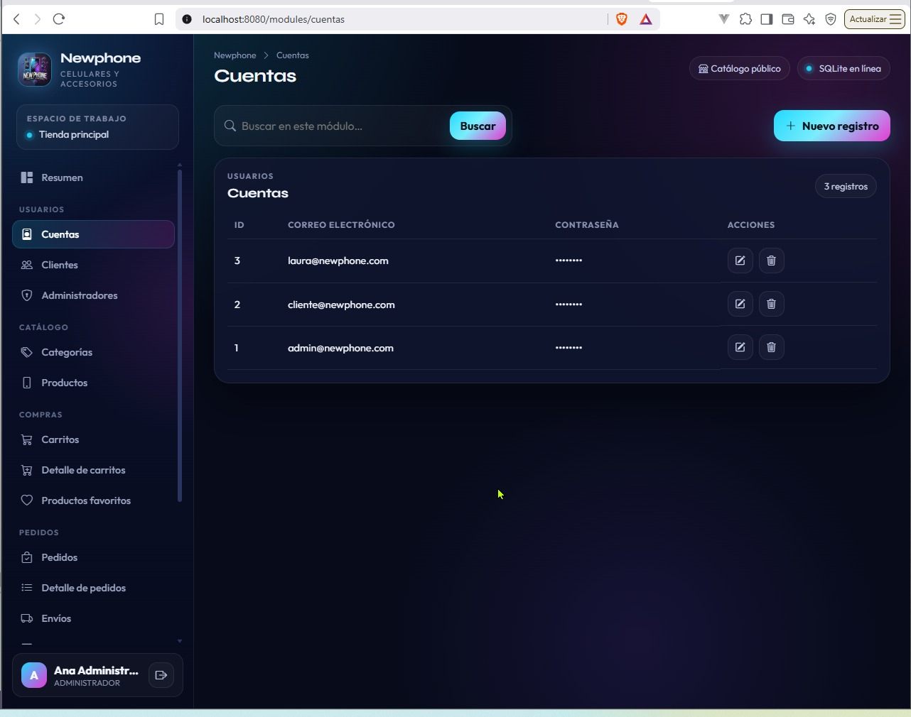

### Módulo Clientes


### Módulo Administradores

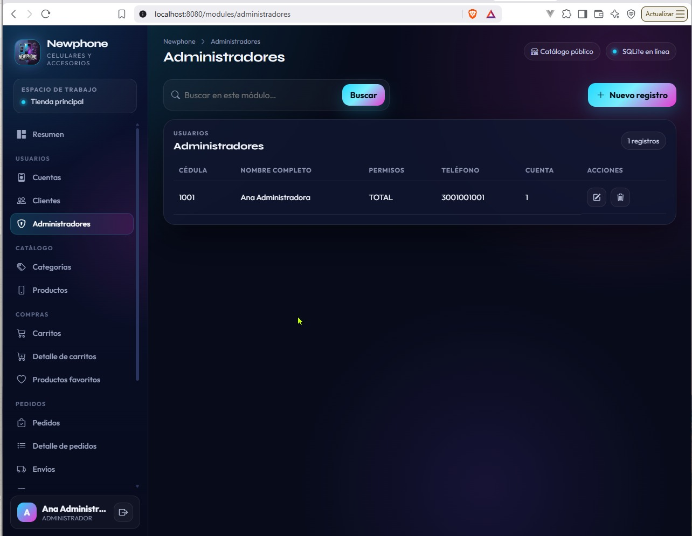

### Módulo Categorías

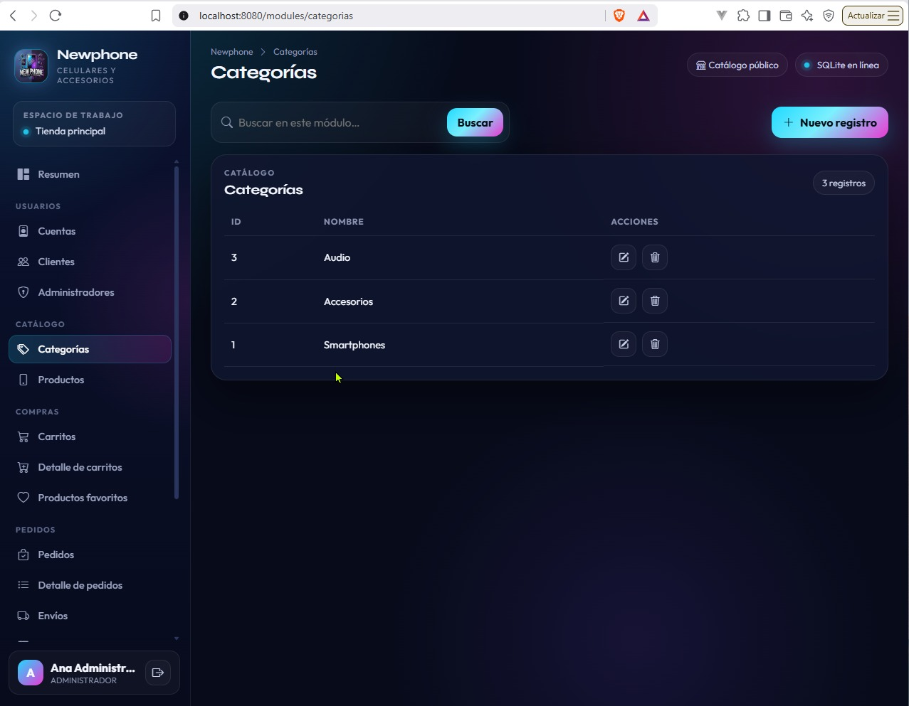

### Módulo Productos

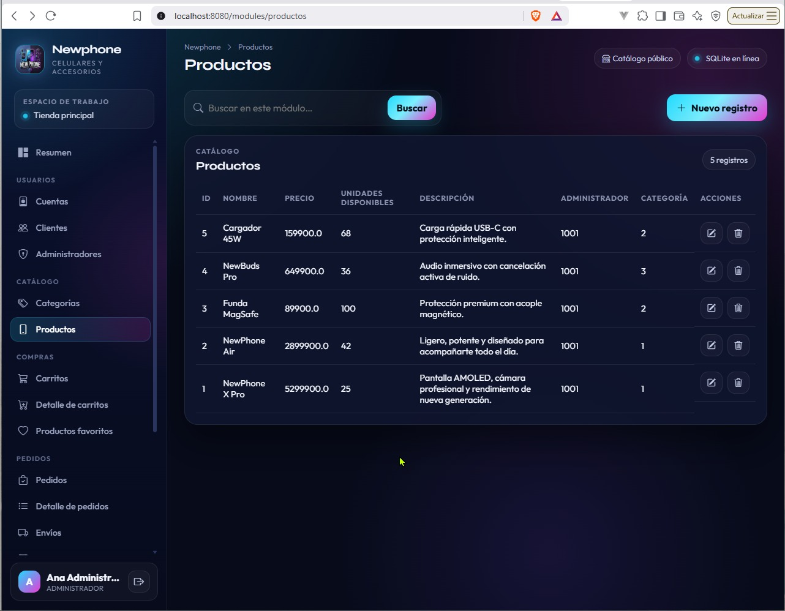

### Formulario — Nuevo producto


### Módulo Carritos


### Formulario — Nuevo carrito

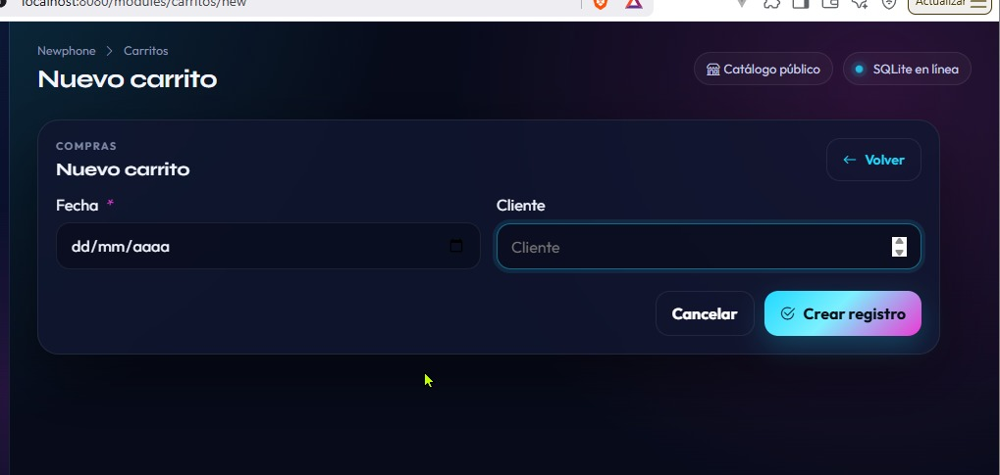

### Módulo Detalle de carritos


### Módulo Productos favoritos

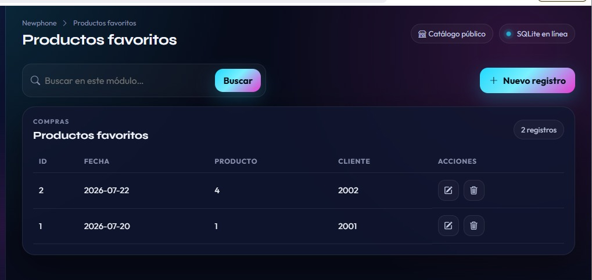

### Módulo Pedidos

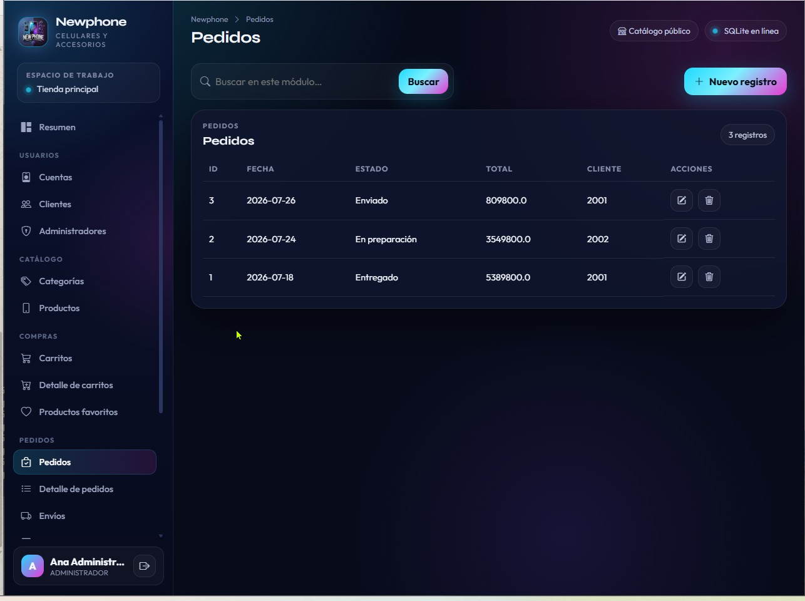

### Módulo Detalle de pedidos

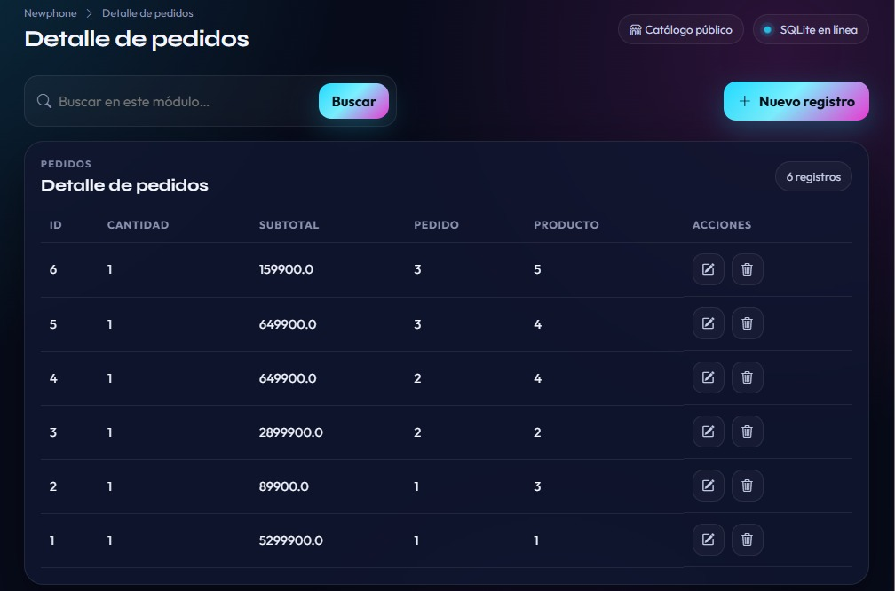

</details>
